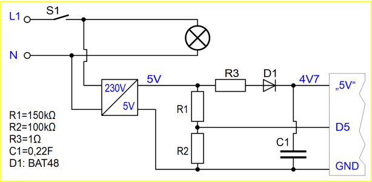
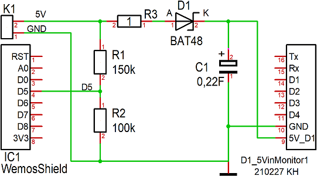
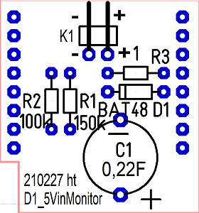
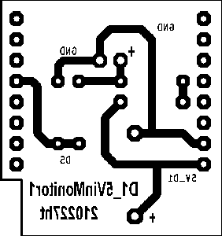

# D1 mini: Eigenbau-Shield D1_5VinMonitor1
Version 2021-02-27, Sketches: D1_ex56_5VinMonitor1.ino   
[--> English Version](./README.md "English Version")   

Das Eigenbau-Shield __D1_230Vmonioff1__ dient zum &Uuml;berwachen der 5V Eingangsspannung f&uuml;r den D1 mini. F&auml;llt die Spannung aus, so geht der Eingang D5 auf 0 und &uuml;ber einen Kondendator wird die Versorgungsspannung noch kurz aufrecht erhalten, sodass abschließende Arbeiten m&ouml;glich sind.   

__*Beispiel f&uuml;r eine praktische Anwendung*__   
Mit Hilfe dieses Boards und eines 5V Netzteiles kann ein D1 mini eine 230V Spannung &uuml;berwachen und bei Ausfall zB eine MQTT-Meldung absetzen. Dazu wird das Netzteil, das den D1 mini mit Spannung versorgt, parallel zum Verbraucher geschaltet (siehe Bild 1).   

   
_Bild 1: Schaltung des Spannungs&uuml;berwachungs-Shields_   

## Hardware
1. WeMos D1 Mini oder ESP32 D1 mini   
2. 5V-Spannungsversorgung und Eigenbau-Shield D1_5VinMonitor1 oder Protoboard mit Spannungsteiler, Diode und St&uuml;tzkondensator   

   
_Bild 2: 230V/5V-Netzteil und D1 mini mit Spannungs&uuml;berwachungs-Shield_   

## Spannungs&uuml;berwachungs-Shield
### Schaltplan
    
_Bild 3: Schaltplan des D1_5VinMonitor1 Shields_   
 
### Bauteilliste D1_5VinMonitor1 Shield

| No   | Name     | Wert   | Geh&auml;use   |
| ---- | -------- | ------ | -------------- |
| 1	| K1	| Stiftleiste_1x02 90&deg; abgewinkelt | 1X02-90 | 
| 2	| R1	| 150k&#8486; Widerstand | 0204 | 
| 3	| R2	| 100k&#8486; Widerstand | 0204 | 
| 4	| R3	| 1&#8486; Widerstand | 0204 | 
| 5	| D1	| BAT48 | DO35 | 
| 6	| C1	| 0,22F Elko | ELKO4 | 
| 7 | IC1	| 2x Buchsenleiste 8-polig mit langen Anschl&uuml;ssen | WemosShield           |   

#### Weiters
1x Durchsichtiges Klebeband (Tixo, Tesa, ...), um Bauteile beim Einl&ouml;ten gegen Herausfallen zu sichern.   
__*Material zur Leiterplattenfertigung:*__   
* Einseitig beschichtete Leiterplatte 28,575 x 26,67 mm&sup2;   
* Entwickler, &Auml;tzmittel, Aceton; L&ouml;tlack; L&ouml;tzinn;   
* Bohrer 0,8mm und 1,0mm

### Vorschlag Best&uuml;ckungsreihenfolge
Alle Bohrungen 0,8mm (au&szlig;er K1, C2: 1,0mm).   
   
_Bild 4: Best&uuml;ckungsplan_

1. Alle Widerst&auml;nde (liegend)   
2. Diode D1 (liegend)
3. Stiftleiste K1   
4. Kondensator C1   
5. Buchsenleisten 8-polig mit langen Anschl&uuml;ssen, links und rechts am Rand des Boards   

### L&ouml;tseite
   
_Bild 5: L&ouml;tseite des D1_5VinMonitor1-Shields_

### Dimensionierung
#### Widerst&auml;nde
F&auml;llt die Versorgungsspannung unter 4,5V, soll der eingelesene Wert von D5 null sein. Dies passiert bei einer Eingangsspannung kleiner als 1,6V:   
Uin = 4,5V, UR2 = 1,6V -> UR1 = Uin - UR2 = 2,9V   
Dies ergibt f&uuml;r das Verh&auml;ltnis der Widerst&auml;nde:   
R1:R2 = 2,9:1,6 = 1,81:1   
__Gew&auml;hlt: R2 = 100k&Omega;, R1 = 150k&Omega;__   

Der Widerstand R3 dient zur Strombegrenzung beim Einschalten (Ladestrom f&uuml;r C1):   
Spannung am Widerstand beim Einschalten: Eingangsspannung 5V - 0,3V an der Diode = 4,7V. Für 1 Ohm ergibt sich somit ein Stromsto&szlig; von _maximal_ 4,7A (bzw. auf Grund des Innenwiderstandes des Netzteils viel weniger). Im Betrieb ergibt sich bei einem Stromverbrauch des D1 mini von zB 120mA ein Spannungsabfall von U = R * I = 1 * 120m = 0,12V   
__Gew&auml;hlt: Widerstand R3 = 1 &Omega;__   

#### Absch&auml;tzung f&uuml;r C1   
Annahmen:   
* Der Stromverbrauch des D1 mini betr&auml;gt zwischen 70mA und 120mA.   
* Die Zeit vom Erkennen des Spannungsabfalles bis zum Ende des Sendens der MQTT-Nachricht betr&auml;gt ca. 52ms, bzw. bis zum Wieder-Eintreffen der Nachricht beim D1 mini 104ms.   
* Der Kondensator wird auf ca. 4,7V aufgeladen.   

Eine grobe Absch&auml;tzung kann &uuml;ber die ben&ouml;tigte elektrische Ladung zum Weiterlaufen des D1 mini erfolgen (Verwendung von statischen Werten statt der realen Zeitverl&auml;ufe):   
Q = C * U = I * t   
C = I * t / U = 120mA * 104ms / 4,7V = 0,12 * 0,104 / 4,7 = 2,7 mF = 2700&micro;F   
Versuche zeigen, dass ein 3300&micro;F Kondensator ausreicht. Sicherheitshalber wird ein Gold-Cap __Kondensator 0,22F/5,5V__ gew&auml;hlt.   

#### Absch&auml;tzung der Startzeit des D1 mini   
Mit R3=1 &Omega; ergibt sich eine Zeitkonstante T = R * C = 0,22s und eine Startzeit von ca. 0,32s (zB Erreichen von ca. 3,6V beim Aufladen auf 4,7V, t = -T * ln(1-u/U0)).   
   
   
# Testprogramm `D1_ex56_5VinMonitor1.ino`   
Dieses Programm dient zum Testen des Eigenbau-Shields `D1_5VinMonitor1` sowie zum Feststellen, wie lange der D1 mini nach dem Abschalten der Versorgungsspannung noch weiterarbeitet (Abschaltverz&ouml;gerung). Dazu muss die 5V Spannungsversorgung &uuml;ber das Shield und nicht &uuml;ber den USB-Anschluss erfolgen.   
Nach dem Einschalten liegt Pin D5 auf 1, die blaue LED blinkt mit 0,5Hz und der Systemzustand wird &uuml;ber die serielle Schnittstelle ausgegeben (zB. `D5=1__LED is on__`). Die zeitliche Steuerung erfolgt mit einem 10ms-Z&auml;hler.   
Wird die Versorgungsspannung abgeschaltet, geht D5 auf 0, die LED wird eingeschaltet, der 10ms-Z&auml;hler auf 0 gesetzt und der Z&auml;hlerstand als Millisekundenwert &uuml;ber die serielle Schnittstelle gesendet, bis die im Kondensator gespeicherte Energie verbraucht ist.   
__*Beispielausgabe auf der seriellen Schnittstelle*__
```   
D5=1__LED is on__
D5=1__LED is off__
D5=1__LED is on__
D5=0__LED is on!
00ms
10ms
20ms
30ms
40ms
50ms
60ms
70ms
80ms
90ms
100ms
110ms
120ms
130ms
140ms
150ms
160ms
170ms
180ms
190ms
Exception in thread rx:
...
```   


