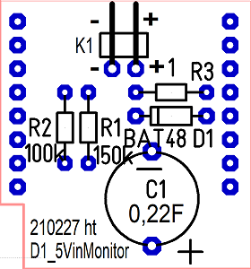
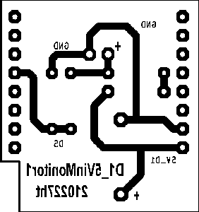

# D1 mini: Selfconstruction shield D1_5VinMonitor1
Version 2021-02-27, Sketches: D1_ex56_5VinMonitor1.ino   
[--> Deutsche Version](./LIESMICH.md "Deutsche Version")   

The selfmade shield __D1_230Vmonioff1__ is used to monitor the 5V input voltage for the D1 mini. If the voltage drops, the input D5 goes to 0 and a capacitor keeps the supply voltage for a short time, so that final work is possible.   

__*Example of a practical application*__      
With the help of this board and a 5V power supply, a D1 mini can monitor a 230V voltage and send an MQTT message in case of failure. For this purpose the power supply, which supplies the D1 mini with voltage, is connected in parallel to the consumer (see figure 1).   

   
_Figure 1: Circuit of the voltage monitoring shield_   

## Hardware
1. WeMos D1 mini or ESP32 D1 mini   
2. 5V power supply and selfmade shield D1_5VinMonitor1 or Protoboard with voltage divider, diode and backup capacitor   

   
_image 2: 230V/5V power supply and D1 mini with voltage monitoring shield_   

## Voltage monitoring shield
### Circuit diagram
    
_Fig. 3: Circuit diagram of the D1_5VinMonitor1 Shield_   
 
### Parts list D1_5VinMonitor1 Shield

| No | Name | Value | Package |
| ---- | -------- | ------ | -------------- |
| 1 | K1 | header_1x02 90&deg; angled | 1X02-90 | 
| 2 | R1 | 150k&#8486; resistor | 0204 | 
| 3 | R2 | 100k&#8486; resistor | 0204 | 
| 4 | R3 | 1&#8486; resistor | 0204 | 
| 5 | D1 | BAT48 | DO35 | 
| 6 | C1 | 0.22F electrolytic capacitor | ELKO4 | 
| 7 | IC1 | 2x female header 8-pin with long connectors | WemosShield |   

#### Further
1x transparent adhesive tape (Tixo, Tesa, ...) to prevent components from falling out when assembling.   
__*Material for PCB production:*__   
* Printed circuit board coated on one side 28.575 x 26.67 mm&sup2;   
* Developer, etchant, acetone; solder resist; solder;
* Drill bits 0.8mm and 1.0mm

### Suggested order of drilling
All holes 0.8mm (except K1, C2: 1.0mm).   
   
_Figure 4: D1_5VinMonitor1 shield - component side_

1. all resistors (lying)   
2. diode D1 (lying)
3. pin header K1   
4. capacitor C1   
5. socket connectors 8-pole with long connections, left and right at the edge of board   

### Solder side
   
_Figure 5: D1_5VinMonitor1 shield - solder side_

### Dimensioning
#### Resistors
If the supply voltage falls below 4.5V, the value read in from D5 should be zero. This happens when the input voltage is less than 1.6V:   
Uin = 4,5V, UR2 = 1,6V -> UR1 = Uin - UR2 = 2,9V   
This gives for the ratio of the resistors:   
R1:R2 = 2.9:1.6 = 1.81:1   
__Selected: R2 = 100k&Omega;, R1 = 150k&Omega;__   

Resistor R3 is used for current limitation at switch-on (charging current for C1):   
Voltage at the resistor at switch-on: Input voltage 5V - 0.3V at the diode = 4.7V. For 1 Ohm this results in a current surge of _maximum_ 4.7A (or much less due to the internal resistance of the power supply). In operation, a current consumption of the D1 mini of e.g. 120mA results in a voltage drop of U = R * I = 1 * 120m = 0,12V   
__Selected: Resistor R3 = 1 &Omega;__   

#### Estimation for C1   
Assumptions:   
* The current consumption of the D1 mini is between 70mA and 120mA.   
* The time from detecting the voltage drop to the end of sending the MQTT message is about 52ms, or until the message arrives back at the D1 mini is 104ms.   
* The capacitor is charged to about 4.7V.   

A rough estimation can be made by the electrical charge needed to keep the D1 mini running (using static values instead of real time lapses):   
Q = C * U = I * t   
C = I * t / U = 120mA * 104ms / 4.7V = 0.12 * 0.104 / 4.7 = 2.7 mF = 2700&micro;F   
Experiments show that a 3300&micro;F capacitor is sufficient. To be on the safe side, a gold-cap __capacitor 0.22F/5.5V__ is chosen.   

#### Estimation of the start time of the D1 mini   
With R3=1 &Omega; this results in a time constant T = R * C = 0.22s and a start time of approx. 0.32s (e.g. reaching approx. 3.6V while charging to 4.7V, t = -T * ln(1-u/U0)).   
   
   
# Test program `D1_ex56_5VinMonitor1.ino`   
This program is used to test the selfmade shield `D1_5VinMonitor1` and to find out how long the D1 mini continues to work after switching off the supply voltage (switch-off delay). For this purpose the 5V power supply must be provided via the shield and not via the USB connector.   
After power-on pin D5 is set to 1, the blue LED flashes with 0.5Hz and the system state is output via the serial interface (e.g. `D5=1__LED is on__`). The time control is done with a 10ms counter.   
If the supply voltage is switched off, D5 goes to 0, the LED is switched on, the 10ms counter is set to 0 and the counter reading is sent as a millisecond value via the serial interface until the energy stored in the capacitor is used up.   
__*Example output on the serial interface*__
```   
D5=1__LED is on__
D5=1__LED is off__
D5=1__LED is on__
D5=0__LED is on!
00ms
10ms
20ms
30ms
40ms
50ms
60ms
70ms
80ms
90ms
100ms
110ms
120ms
130ms
140ms
150ms
160ms
170ms
180ms
190ms
Exception in thread rx:
...
```   