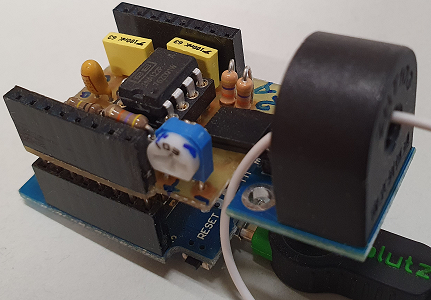
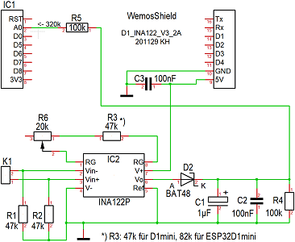
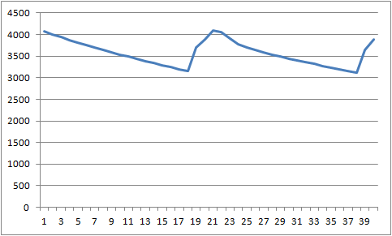
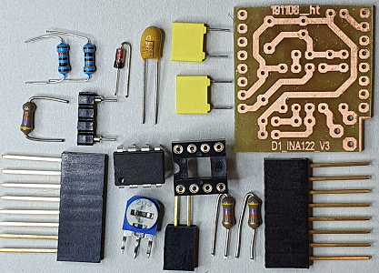
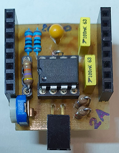
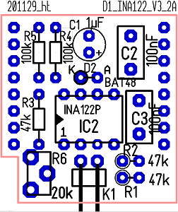
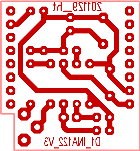

# D1 mini: Eigenbau-Shield D1_INA122
Version 2020-12-10, Sketches: ESP32D1_CurrentAC_*.ino   
[--> English version](./README.md "English version")   

Das Eigenbau-Shield __D1_INA122__ dient zur Verst&auml;rkung und Gleichrichtung kleiner Wechselspannungen. Zu diesem Zweck wird ein Pr&auml;zisionsinstrumentenverst&auml;rker INA122P und eine Gleichrichterdiode BAT48 eingesetzt.   
Verwendet man f&uuml;r die Wechselstrommessung einen Stromwandler ASM010 mit Shuntwiderstand, so kann der Wert unter Verwendung des Selbstbau-Shields D1_INA122 &uuml;ber den Analog In Eingang A0 des D1 mini gemessen werden.

Zum Einlesen des Stromwertes kann die Klasse __CurrentAC__ verwendet werden (Dateien `D1_class_CurrentAC.h` und `D1_class_CurrentAC.cpp`). Diese Klasse ist sowohl f&uuml;r den D1 mini als auch das Board ESP32 D1 mini geeignet (Auswahl &uuml;ber Konstruktor). Der eingelesene Analogwert wird mit Hilfe einer Umwandlungskurve in einen Stromwert (in Ampere) umgerechnet.

        
_Bild 1: D1 mini mit D1_INA122 Shield und angestecktem ASM010 Stromwandler (rechts im Bild)_   

# D1_INA122 Shield - Details
### Schaltplan
      
_Bild 2: Schaltung des D1_INA122 Shields zur Messung von Wechselstr&ouml;men bis 2A_   

### Dimensionierung
Wenn man als Messprinzip eine Messung &uuml;ber mehrere Perioden nimmt, ergibt sich folgendes Problem:
* Nach der Gleichrichtung des Operationsverst&auml;rker-Ausgangssignals muss dieses f&uuml;r die Analog-Digital-Wandlung gegl&auml;ttet (konstant gehalten) werden.
* Die Periodendauer eines 50Hz-Sinus-Signals betr&auml;gt 20ms. Will man mit __einem__ Einlesevorgang die H&ouml;he des Stromes erfassen, muss die Spannung sehr gut gegl&auml;ttet werden, das hei&szlig;t, die Zeitkonstante T = R4 * (C1+C2) muss sehr gro&szlig; sein:   
Beispiel: F&uuml;r 1% Fehler ergibt sich bei ca. 5ms Ladezeit und t1=15ms Entladezeit T = -t1/ln(0,99) = 1,492s.   
Schaltet man dann aber den Strom ab, dauert es entsprechend lange, bis sich die Kondensatoren C1+C2 entladen haben und es wird sehr lange ein "Stromwert" eingelesen, obwohl gar kein Strom mehr flie&szlig;t.   
Beispiel: nimmt man 5% "Reststrom" an, so wird dieser Wert bei einer e-Funktion nach ca. 3T erreicht (genauer -ln(0,05)=2,996T). F&uuml;r T=1,492s bedeutet dies fast 4 1/2 Sekunden!
* W&auml;hlt man die Zeitkonstante T = R4 * (C1+C2) zu klein, so misst man - je nach Zeitpunkt innerhalb des 50Hz-Signals - mit nur __einer__ Messung den Momentanwert des Lade-/Entladezustands (siehe Bild 3). Das kann sowohl das Maximum der Wechselspannung, als auch ein entsprechend niedrigerer Wert sein.
* Das Einschalten des Stromes ist hingegen kein Problem, da der Operationsverst&auml;rker die Kondensatoren C1+C2 schnell aufladen kann (Begrenzung nur durch den Innenwiderstand des INA122P).   

      
_Bild 3: Beispiel f&uuml;r den zeitlichen Verlauf des Analog In Signals &uuml;ber eine 50Hz-Periode (2x20 Messpunkte im 1ms-Abstand)_    

___Widerstand R1, R2___   
Siehe Datenblatt des INA122.

___Widerstand R3___   
Da die Eingangsschaltungen beim D1 mini und ESP32 D1mini unterschiedlich sind, werden auch unterschiedliche Verst&auml;rkungen ben&ouml;tigt. Die Verst&auml;rkung der Schaltung berechnet sich zu v = 5 + 200k&#8486; / Rg, wobei Rg = R3 + (Teil von) R6 ist.   
Beispiel: R3 = 47k&#8486; oder 56k&#8486; f&uuml;r D1 mini, R3 = 82k&#8486; f&uuml;r ESP32 D1 mini   

___Widerstand R4, Kondensatoren C1, C2___   
F&uuml;r die Dimensionierung der Zeitkonstante T = R4 * (C1+C2) gilt grunds&auml;tzlich, dass der Kondensatorwert m&ouml;glichst klein sein soll, damit die ben&ouml;tigte Ladung bzw. die Ladestr&ouml;me m&ouml;glichst klein sind (Ladung q = C * u, Strom i=q/t). Dies bedingt, dass der Widerstand gro&szlig; wird, was grunds&auml;tzlich kein Problem darstellt. In diesem Fall ist dem Widerstand R4 allerdings der Analog-Eingang des D1 mini parallel geschaltet, der aus einem Spannungsteiler von 220k&#8486; + 100k&#8486; besteht (Eingangsspannung 3,2V auf 1V f&uuml;r DAC). 
Aus diesem Grund wird R4 mit 100k&#8486; festgelegt.   
W&auml;hlt man C1=1µF und C2=100nF, so ergibt sich eine Zeitkonstante von T = 100k*1,1µ = 110ms. Bei einem Abschaltvorgang ist demnach der Strom nach 330ms "aus" (<5%). 

___Widerstand R5___   
Da der Analogeingang des D1 mini f&uuml;r 3,3V ausgelegt ist, wird zur Messbereichserweiterung noch ein Widerstand R5 (100k&#8486;) in Serie geschaltet.

___Diode D2___   
Da die Kondensatoren C1+C2 bis auf die Ausgangsspannung des INA122 aufgeladen werden, spielt der Spannungsabfall an der Diode letztendlich keine Rolle (kein Strom, keine Spannung).   

### Bauteilliste D1_INA122

| Stk | Name       | Wert            | Geh&auml;use         |
| --- | ---------- | --------------- | -------------------- |
|  1  | K1         | 2polige Buchsenleiste_1x2 Pin 90&deg; abgewinkelt (Anschluss von ASM010) |      |
|  1  | IC2        | INA122P         | DIL8                 |
|  2  | R4, R5     | 100k&#8486;     | 0204_MET liegend     |
|  2  | R1, R2     |  47k&#8486;     | 0207_STEHEND         |
|  1  | R3         |  47k&#8486; (82k&#8486; f&uuml;r ESP32 D1 mini) f&uuml;r 2A | 0204   |
|  1  | R6         |  20k&#8486;     | TRIMMER_CA6H stehend |
|  1  | D2         | BAT48           | DO35_STEHEND_K_UNTEN |
|  1  | C1         | 1&micro;F             | D5R2,54_ELKO         |
|  2  | C2, C3     | 100nF           | 4X8R5,08             |
| --- | ---------- | --------------- | -------------------- |
|  1  | IC2        | 8polige Fassung | DIL8                 |
|  1  | R3         | 2polige Fassung f&uuml;r Widerstand R3 (aus 4poliger Stiftleiste hergestellt) |
|  2  | IC1        | 8polige Buchsenleiste mit langen Anschl&uuml;ssen |

 &nbsp;    
_Bild 4: Bauteile des D1_INA122 Shields_   

### Best&uuml;ckungsplan
 &nbsp;    
_Bild 5: Bauteil- und L&ouml;tseite des D1_INA122 Shields_   

#### Reihenfolge der Best&uuml;ckung
* Liegende Bauelemente: K1, R4, R5
* Fassungen: IC2, R3
* Stehende Bauelemente: Widerst&auml;nde R1, R2, Diode D2 (Kathode unten), Kondensatoren C1, C2, C3, Trimmer R6
* 8polige Stiftleisten

# Software
## Inbetriebnahme und Test des D1_INA122 Shields
Die Inbetriebnahme und der Test des D1_INA122 Shields erfolgt zumindest in zwei Schritten. Im ersten Schritt wird die Verst&auml;rkung des INA122 mit Hilfe des Trimmers fein eingestellt. Danach kann man mit der voreingestellten Ausgleichskurve bereits messen. Stimmen die angezeigten Werte nicht mit den mit einem Multimeter gemessenen Werten &uuml;berein, kann man selbst St&uuml;tzpunkte aufnehmen und diese Werte verwenden. Wie man eigene Werte verwendet, wird im Beispielprogramm `ESP32D1_CurrentAC_2simulate` gezeigt.   
 
_Beispiel 1_: Justage der Verst&auml;rkung (Trimmer R6)   
Mit Hilfe des Programms `ESP32D1_CurrentAC_1adjustShield` soll der Trimmer R6 so eingestellt werden, dass beim maximalen Strom (zB 2A) ca. 4 Maximalwerte des AD-Wandlers erreicht werden (dies ergibt einen ain-Wert von ca. 947 oder 3920).   
Beispiel: Bildschirmausgabe f&uuml;r D1 mini:   
```   
998;987;972;960;946;937;925;914;903;892;880;905;1024;1024;1024;1024;1020;1008;996;984;968;956;944;933;922;906;895;885;874;1005;1024;1024;1024;1024;1011;999;987;972;960;949;
Period 0: number of 1023-values (maximum is 20) 4
Period 1: number of 1023-values (maximum is 20) 4
964  (=3.015V)
903;892;882;895;1024;1024;1024;1024;1020;1008;996;982;968;956;944;933;921;912;900;889;873;965;1024;1024;1024;1024;1015;1003;990;974;963;952;940;928;917;906;895;885;874;1004;
Period 0: number of 1023-values (maximum is 20) 4
Period 1: number of 1023-values (maximum is 20) 4
956  (=2.990V)
```   
Die Strichpunkt-getrennten Werte k&ouml;nnen in eine Datei `test.csv` kopiert, abgespeichert und zB mit OpenOffice ge&ouml;ffnet werden. Markiert man die Werte und erstellt ein xy-Diagramm (nur Linien), so ergibt sich folgendes Bild:   
")   
_Bild 6: Spannungsverlauf ain = f(t) mit 4 Maximalwerten_   

_Beispiel 2_: Test der Klasse CurrentAC   
Mit Hilfe des Programms `ESP32D1_CurrentAC_2simulate` k&ouml;nnen Funktionen der Klasse `CurrentAC` ohne die Hardware getestet werden. Dazu werden verschiedene Referenzpunkte festgelegt und f&uuml;r simulierte ADC-Werte der vom Programm ausgegebene Wert mit dem h&auml;ndisch berechneten Wert verglichen.   

_Beispiel 3_: Anzeige von Stromwerten &uuml;ber die serielle Schnittstelle   
Mit Hilfe des Programms `ESP32D1_CurrentAC_3measure2Serial` werden die vom Stromwandler ASM010 aufgenommenen und vom D1_INA122 Shield verst&auml;rkten Wechselstr&ouml;me letztendlich als Stromwerte &uuml;ber die serielle Schnittstelle &uuml;bertragen.   
Vergleicht man die angezeigten Werte mit den mit einem Multimeter gemessenen Werten und stimmen diese nicht gut &uuml;berein, so kann man mit Hilfe des Programms `ESP32D1_CurrentAC_1adjustShield` selbst Testpunkte festlegen. (Spannung einstellen, ACD-Wert und Spannungswert notieren).

&nbsp;

## Die Klasse `CurrentAC`
Die Klasse `CurrentAC` stellt Methoden zur Strommessung und zum Anpassen der Eigenschaften zur Verf&uuml;gung. Da der Zusammenhang zwischen Strom und eingelesenem Analogwert nicht linear ist (siehe Bild 6), wird die Kurve in mehrere lineare Abschnitte unterteilt und als "Endpunkt" des Messbereichs ein Nennwert (Nominalwert) definiert, der zirka bei 91%..95% des Endwertes (1023, 4096, ...) liegen sollte. Die St&uuml;tzpunkte der Kurve werden in zwei Feldern gespeichert (`int xPoints_[]` und `float yPoints_[]`). Vorgabewert ist maximal 20 Punkte (Konstante `CURRENTAC_POINTS_MAX`).     
") &nbsp; ")      
_Bild 7: Zusammenhang zwischen Stromwert iAC und eingelesenem Analogwert ain: iAC = f(ain)_   


| Klasse CurrentAC             | Konstruktoren und Co                                 |
| ---------------------------- | ---------------------------------------------------- |
| + CurrentAC()                | Vorgabekonstruktor. Setzt den Board-Typ auf D1 mini, den ADC-Pin auf A0 und den "On"-Strom auf 0,044A (= 10W an 230V). Ruft setup() auf |
| + CurrentAC(float inom_A, float ion_A)     | Konstruktor. Setzt den Board-Typ auf D1 mini, den ADC-Pin auf A0 und den Nominalstrom sowie "On"-Strom auf die gegebenen Werte. Ruft setup() auf |
| + CurrentAC(int boardType)   | Konstruktor. Setzt den Board-Typ. Erlaubt sind die Werte 1=D1mini oder 2=ESP32D1. Ruft setup() auf |
| + CurrentAC(int boardType, float inom_A, float ion_A)   | Konstruktor. Setzt den Board-Typ, den Nennstrom und den "On"-Strom auf die gegebenen Werte. Ruft setup() auf |
| + CurrentAC(int boardType, float inom_A, float ion_A, int pin)    | Konstruktor. Setzt den Board-Typ, den ADC-Pin, den Nennstro und den "On"-Strom auf die gegebenen Werte. Ruft setup() auf |
| ~ void setup(int boardType, float inom_A, float ion_A, int pin)   | Setzt alle Eigenschaften auf die Vorgabewerte   |

&nbsp;

| Messwerte holen              |                                                      |
| ---------------------------- | ---------------------------------------------------- |
| + float  getCurrent()        | Wechselstrom messen und den Wert in Ampere zur&uuml;ckgeben   |
| + int    getLastAin()        | ADC-Wert der letzten Messung (0...1023 oder 4095)   |
| + bool   isOn()              | true: Strom ist ein, d.h. gr&ouml;&szlig;er als der "On"-Wert (>aOn_) (L&ouml;st Messung aus)   |
| + bool   isOff()             | true: Strom ist aus, d.h. kleiner oder gleich dem "On"-Wert (<=aOn_) (L&ouml;st Messung aus)   |
| + bool   isChange()          | true: &Auml;nderung des Ein-/Aus-Zustands seit der letzten Abfrage (L&ouml;st Messung aus)   |
| + float  getCurrentOn()      | Strom-Limit f&uuml;r den "On"-Zustand   |
| + float  getNominalCurrent() | Abfrage des Strom-Normwerts   |

&nbsp;

| Setzen von Parametern        |                                                      |
| ---------------------------- | ---------------------------------------------------- |
| + bool   setCurrentOn(float onAmpere)   | Setzt das Strom-Limit f&uuml;r "on"   |
| + bool   setNominalCurrent(float inom_A)   | Setzt den Nennstrom (Nominalwert)  | 
| + bool   setx4max(int x4max)            | Setzt den ADC-Wert f&uuml;r den maximalen Strom (zB 2 A). Einfache Anpassung eines Endwertes |
| + void   setNumberOf50HzPeriods(int periods)   | Setzt die Anzahl der 50Hz-Perioden, die gemessen werden sollen. Die Dauer der Messung ist die Anzahl Perioden mal 20ms   |
| + bool   setBoardType(int boardType)  | Setzt den uC-Board-Typ: 1=D1mini, 2=ESP32D1  |
| + bool   setPinAin(int pin)           | Setzt den Analog In Pin (A0 beim D1 Mini)   |


&nbsp;

| St&uuml;tzpunkte             |                                                      |
| ---------------------------- | ---------------------------------------------------- |
| + bool   setRefPoints()      | Ohne Parameter: Verwendung der Vorgabewerte          |
| + bool   setRefPoints(int num, int xValues[], float yValues[])   | Setzt die St&uuml;tzpunkte; num = Anzahl Punkte |
| + String getsRefPoints()     | Ergibt die St&uuml;tzpunkte als String |

&nbsp;

| Weitere Funktionen           |                                                      |
| ---------------------------- | ---------------------------------------------------- |
| + float  getCurrent(int ain_code) | Berechnet den Stromwert zum gegebenen Analog-In-Wert |
| + int    measure()           | Strommessung (Anzahl Perioden, 20 Werte pro Periode) |


