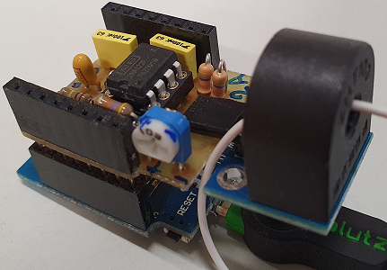
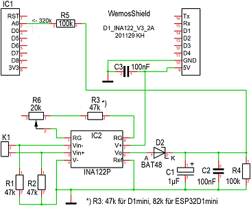
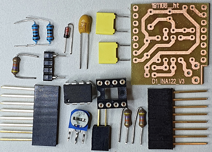
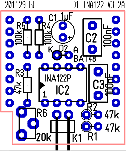
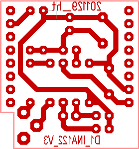

# D1 mini: Selfconstruction shield D1_INA122
Version 2020-12-04, Sketches: ESP32D1_CurrentAC_*.ino        
[--> Deutsche Version](./LIESMICH.md "Deutsche Version")   

The selfconstruction shield __D1_INA122__ can be used to amplify and rectify small alternating voltages. For this purpose a precision instrument amplifier INA122P and a rectifier diode BAT48 are used.   
If an ASM010 current transformer with shunt resistor is used for the AC current measurement, the value can be measured using the Do-It-Yourself Shield D1_INA122 via the Analog In input A0 of the D1 mini.   

The __CurrentAC__ class can be used to read in the current value (files `D1_class_CurrentAC.h` and `D1_class_CurrentAC.cpp`). This class is suitable for both the D1 mini and the ESP32 D1 mini board (selection via constructor). The read-in analog value is converted into a current value (in amperes) by means of a conversion curve.

        
_Figure 1: D1 mini with D1_INA122 Shield and connected ASM010 current transformer (right side of picture)_   

# D1_INA122 Shield - Details
### Circuit Diagram
      
_Figure 2: Circuit of the D1_INA122 Shield for measurement of alternating current up to 2A_   

### Dimensioning
After rectifying the operational amplifier output signal, it must be smoothed (kept constant) for the analog-to-digital conversion. This results in the following problem:   
* The period of a 50Hz sine signal is 20ms. If you want to measure the current with __one__ read-in process, the voltage must be smoothed very well, i.e. the time constant T = R4 * (C1+C2) must be very large:   
Example: For a 1% error, a charge time of about 5ms and a discharge time of t1=15ms results in T = -t1/ln(0.99) = 1.492s.   
But if you switch off the current, it takes a long time until the capacitors C1+C2 have discharged and a "current value" is read in for a very long time, although no current is flowing at all.   
Example: if you assume 5% "residual current", this value is reached after approx. 3T in an e-function (more precisely -ln(0.05)=2.996T). For T=1.492s this means almost 4 1/2 seconds!
* If the time constant T = R4 * (C1+C2) is too small, then - depending on the time within the 50Hz signal - the instantaneous value of the charge/discharge state is measured with only __one__ measurement (see Figure 3). This can be the maximum of the AC voltage or a lower value.
* Switching on the current, on the other hand, is not a problem because the operational amplifier can quickly charge the capacitors C1+C2 (limited only by the internal resistance of the INA122P).   

      
_Figure 3: Example for the time course of the Analog In signal over a 50Hz period (2x20 measuring points in 1ms intervals)_    

___Resistor R1, R2___   
See data sheet of the INA122.

___Resistor R3___   
Since the input circuits of the D1 mini and ESP32 D1mini are different, different amplification is required. The circuit gain is calculated as v = 5 + 200k&#8486; / Rg, where Rg = R3 + (part of) R6.   
Example: R3 = 47k&#8486; or 56k&#8486; for D1 mini, R3 = 82k&#8486; for ESP32 D1 mini   

___Resistor R4, capacitors C1, C2___   
For the dimensioning of the time constant T = R4 * (C1+C2) it is valid in principle that the capacitor value should be as small as possible, so that the required charge or the charge current is as small as possible (charge q = C * u, current i=q/t). This causes the resistance to become large, which is not a problem in principle. In this case, however, resistor R4 is connected in parallel to the analog input of the D1 mini, which consists of a voltage divider of 220k&#8486; + 100k&#8486; (input voltage 3.2V to 1V for DAC). 
For this reason R4 is set to 100k&#8486;.   
If C1=1µF and C2=100nF, the time constant is T = 100k*1.1µ = 110ms. In case of a switch-off process the current is "off" after 330ms (<5%). 

___Resistor R5___   
Since the analog input of the D1 mini is designed for 3.3V, a resistor R5 (100k&#8486;) is connected in series to extend the measuring range.

___Diode D2___   
Since the capacitors C1+C2 are charged up to the output voltage of the INA122, the voltage drop at the diode is ultimately irrelevant (no current, no voltage).   

### Component list D1_INA122

| Pcs | Name       | Value           | Package              |
| --- | ---------- | --------------- | -------------------- |
|  1  | K1         | 2pin female connector_1x2 Pin 90&deg; angled (connection of ASM010) | |
|  1  | IC2        | INA122P         | DIL8            |
|  2  | R4, R5     | 100k&#8486;     | 0204_MET lying  |
|  2  | R1, R2     | 47k&#8486;      | 0207_STANDING   |
|  1  | R3         | 47k&#8486; (82k&#8486; for ESP32 D1 mini) for 2A | 0204 |
|  1  | R6         | 20k&#8486;      | TRIMMER_CA6H standing |
|  1  | D2         | BAT48           | DO35_STANDING_K_DOWN |
|  1  | C1         | 1µF             | D5R2,54_ELKO |
|  2  | C2, C3     | 100nF           | 4X8R5.08 |   
| --- | ---------- | --------------- | -------------------- |
|  1  | IC2        | 8pin socket | DIL8 |
|  1  | R3         | 2-pole socket for resistor R3 (made of 4-pole male connector) |
|  2  | IC1        | 8pin female connector strip with long connectors |

 &nbsp;    
_Figure 4: Components of the D1_INA122 Shield_   

### Layout Diagram
 &nbsp;    
_Figure 5: Component and solder side of the D1_INA122 Shield_   

#### Order of placement
* Horizontal components: K1, R4, R5
* Frames: IC2, R3
* Standing components: resistors R1, R2, diode D2 (cathode down), capacitors C1, C2, C3, trimmer R6
* 8pin male connectors

# Software
## Commissioning and testing the D1_INA122 shield
Commissioning and testing of the D1_INA122 Shield takes place in at least two steps. In the first step, the amplification of the INA122 is fine-tuned using the trimmer. Afterwards, the pre-set compensation curve can already be used for measurement. If the displayed values do not match the values measured with a multimeter, you can record the values yourself and use these values. How to use own values is shown in the example program `ESP32D1_CurrentAC_2simulate`.   


_Example 1_: Adjustment of the amplification (Trimmer R6)   
With the help of the program `ESP32D1_CurrentAC_1adjustShield` the trimmer R6 is to be adjusted in such a way that at the maximum current (e.g. 2A) approx. 4 maximum values of the AD converter are reached (this results in an ain value of approx. 947 or 3920).   
Example: Screen output for D1 mini:   
```   
998;987;972;960;946;937;925;914;903;892;880;905;1024;1024;1024;1024;1020;1008;996;984;968;956;944;933;922;906;895;885;874;1005;1024;1024;1024;1024;1011;999;987;972;960;949;
Period 0: number of 1023-values (maximum is 20) 4
Period 1: number of 1023-values (maximum is 20) 4
964  (=3.015V)
903;892;882;895;1024;1024;1024;1024;1020;1008;996;982;968;956;944;933;921;912;900;889;873;965;1024;1024;1024;1024;1015;1003;990;974;963;952;940;928;917;906;895;885;874;1004;
Period 0: number of 1023-values (maximum is 20) 4
Period 1: number of 1023-values (maximum is 20) 4
956  (=2.990V)
```   
The semicolon separated values can be copied into a file `test.csv`, saved and opened with OpenOffice. If you mark the values and create an xy-diagram (only lines), you get the following figure:      
")   
_Figure 6: Voltage curve ain = f(t) with 4 maximum values_   

_Example 2_: Test of the class CurrentAC   
The program `ESP32D1_CurrentAC_2simulate` can be used to test functions of the class `CurrentAC` without the hardware. For this purpose different reference points are defined and for simulated ADC values the value output by the program is compared with the manually calculated value.   

_Example 3_: Display of current values via the serial interface   
With the help of the program `ESP32D1_CurrentAC_3measure2Serial` the alternating currents picked up by the ASM010 current transformer and amplified by the D1_INA122 shield are finally transmitted as current values via the serial interface.   
If you compare the displayed values with the values measured with a multimeter and they do not match well, you can set test points yourself with the help of the program `ESP32D1_CurrentAC_1adjustShield`. (Adjust voltage, note ACD value and voltage value).

&nbsp;

## Class `CurrentAC`
The class `CurrentAC` provides methods for current measurement and property adjustment. Since the relationship between the current and the read-in analog value is not linear (see figure 6), the curve is divided into several linear sections. The points of the curve are stored in two fields (`int xPoints_[]` and `float yPoints_[]`). Default value is a maximum of 20 points (constant `CURRENTAC_POINTS_MAX`).    
  
") &nbsp; ")      
_Figure 7: Relationship between current value iAC and read-in analog value ain: iAC = f(ain)_   


| Class CurrentAC | Constructors and Co |
| ---------------------------- | ---------------------------------------------------- |
| + CurrentAC() | Default constructor. Sets the board type to D1 mini, the ADC pin to A0 and the "on" current to 0.044A (= 10W at 230V). Calls setup() |
| + CurrentAC(float ion_A) | Constructor. Sets the board type to D1 mini, the ADC pin to A0 and the "on" current to the given value. Calls setup() |
| + CurrentAC(int boardType) | Constructor. Sets the board type. Allowed are the values 1=D1mini or 2=ESP32D1. Calls setup() |
| + CurrentAC(int boardType, float ion_A) | Constructor. Sets the board type and the "on" current to the given value. Calls setup() |
| + CurrentAC(int boardType, float ion_A, int pin) | Constructor. Sets the board type, the ADC pin, and the "on" current to the given value. Calls setup() |
| ~ void setup(int boardType, float ion_A, int pin) | Set all properties to default values |

&nbsp;

| Get measured values | |
| ---------------------------- | ---------------------------------------------------- |
| + float getCurrent() | measure alternating current and return the value in amperes |
| + int getLastAin() | ADC value of the last measurement (0...1023 or 4095) |
| + bool isOn() | true: current is on, i.e. gr&ouml;&szlig;er as the "on" value (>aOn_) (L&ouml;st measurement off) |
| + bool isOff() | true: current is off, i.e. less than or equal to the "On" value (<=aOn_) (L&ouml;st measurement off) |
| + bool isChange() | true: &Change of the on/off state since the last query (L&ouml;st measurement off) |
+ float getCurrentOn() | current limit for the "on" state |

&nbsp;

| Set parameters | |
| ---------------------------- | ---------------------------------------------------- |
+ void setCurrentOn(float onAmpere) | Sets the current limit for "on" |
| + bool setx4max(int x4max) | Sets the ADC value for the maximum current (e.g. 2 A). Simple adjustment of a final value |
| + void setNumberOf50HzPeriods(int periods) | Sets the number of 50Hz periods to be measured. The duration of the measurement is the number of periods times 20ms |

&nbsp;

| support points |
| ---------------------------- | ---------------------------------------------------- |
| + bool setRefPoints() | Without parameters: Use the default values |
| + bool setRefPoints(int num, int xValues[], float yValues[]) | Set the support points; num = number of points |
| + String getsRefPoints() | Returns the support points as string |

&nbsp;

| Other functions | |
| ---------------------------- | ---------------------------------------------------- |
| + float getCurrent(int ain_code) | Calculates the current value to the given analog in value |
| + int measure() | Current measurement (number of periods, 20 values per period) |

