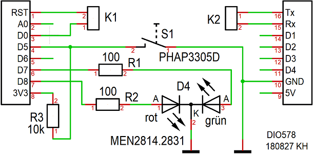

# D1 mini: DIO578 Shield
Version 2018-08-27   
[<u>English Version</u>](./README.md "English Version") &nbsp; - &nbsp; [<u>Deutsche Beschreibung als pdf</u>](./doku/D1mini_DIO578_180827.pdf "Deutsche Beschreibung")

Das DIO578-Shield ist eine Erweiterung f&uuml;r das D1mini-Board der chinesischen Firma WEMOS und kann auf dieses einfach aufgesteckt werden. Es ist f&uuml;r einfache Beispiele zur digitalen Ein- und Ausgabe gedacht und enth&auml;lt eine Duo-LED (rot-gr&uuml;n) und einen Taster.   

 
Folgende IO-Funktionen sind auf dem DIO578-Shield verf&uuml;gbar oder auf Stifte  herausgef&uuml;hrt:  

* D5 ........... Taster gegen Masse (und 10k&#8486; Pullup-Widerstand)
* D7 ........... gr&uuml;ne LED (Duo-LED)
* D8 ........... rote LED (Duo-LED)
* D0-RST .. Eine Verbindung von D0 zu RST erm&ouml;glicht es, aus dem Tiefschlaf aufwachen
* Tx, Rx .... Serielle Schnittstelle

# DIO578 Shield - Details
### Schaltplan
    
_Bild: Schaltplan des DIO578-Shields_   
 
### Bauteilliste DIO578 Shield

| No   | Name     | Wert   | Geh&auml;use   |
| ---- | -------- | ------ | -------------- |
| 1	| K1	| Stiftleiste_1x02 90&deg; abgewinkelt | 1X02-90 | 
| 2	| K2	| Stiftleiste_1x02 90&deg; abgewinkelt | 1X02-90 | 
| 3	| R1	| 100&#8486; Widerstand | 0204 | 
| 4	| R2	| 100&#8486; Widerstand | 0204 | 
| 5	| R3	| 10k&#8486; Widerstand | 0204 | 
| 6	| D4	| Duo-Led MEN2814.2831	| EINZEL-LED-BAUSTEIN_DUO | 
| 7	| S1	| Taster PHAP3305D	| KURZHUBTASTER_11,85 | 
| 8 | 2x  | Buchsenleiste 8-polig mit langen Anschl&uuml;ssen | WemosShield           |   

### Weiters

1x Jumper (f&uuml;r K1 zum Verbinden von D0 mit RST)   
1x Durchsichtiges Klebeband (Tixo, Tesa, ...), um Bauteile beim Einl&ouml;ten gegen Herausfallen zu sichern.   
1x Material zur Leiterplattenfertigung:   
Einseitig beschichtete Leiterplatte 28,575 x 26,67 mm&sup2;   
Entwickler, &Auml;tzmittel, Aceton; L&ouml;tlack; L&ouml;tzinn;   
1x Bohrer 0,8mm und 1,0mm

### Vorschlag Best&uuml;ckungsreihenfolge
Alle Bohrungen 0,8mm (au&szlig;er K1, K2: 1,0mm).   
   
_Bild: Best&uuml;ckungsplan_

1. Stiftleiste K1 und K2   
2. Alle Widerst&auml;nde (liegend)   
3. Duo-LED   
4. Taster   
5. Buchsenleisten 8-polig mit langen Anschl&uuml;ssen, links und rechts am Rand   

### L&ouml;tseite
   
_Bild: L&ouml;tseite des DIO578-Shields_
