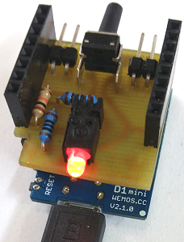
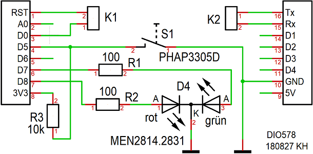
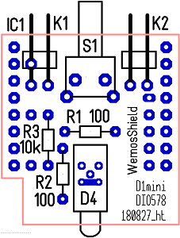
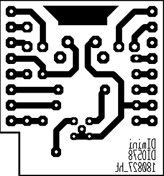

# D1 mini: DIO578 Shield
Version 2018-08-27   
[<u>Deutsche Version</u>](./LIESMICH.md "Deutsche Version") &nbsp; - &nbsp; [<u>German documentation as pdf</u>](./doku/D1mini_DIO578_180827.pdf "German documentation")

The DIO578 shield is an extension for the WEMOS D1mini board and can be put on the board. It is used for simple digital input and output example programs and includes a Duo-LED (red-green) and a button.   

The following IO functions of the DIO578 shield are located on the edge of the board:  

* D5 .......... button to ground (and 10k&#8486; pullup restistor)
* D7 .......... green LED (Duo-LED)
* D8 .......... red LED (Duo-LED)
* D0-RST .. a connection D0 - RST allows the D1 mini to wake up after deep sleep
* Tx Rx .... data pins of serial interface RS232

# DIO578 Shield - Details
### Circuit
    
_Bild: Circuit DIO578 shield_   
 
### Part list of shield DIO578
| No	| Name	| Value	| Package type |
| ---- | -------- | ------ | -------------- |
| 1	| K1	| Pin header 1x02 90&deg; angled | 1X02-90 | 
| 2	| K2	| Pin header 1x02 90&deg; angled | 1X02-90 | 
| 3	| R1	| 100&#8486; resistor | 0204 | 
| 4	| R2	| 100&#8486; resistor | 0204 | 
| 5	| R3	| 10k&#8486; resistor | 0204 | 
| 6	| D4	| Duo led MEN2814.2831	| EINZEL-LED-BAUSTEIN_DUO | 
| 7	| S1	| Button PHAP3305D	| KURZHUBTASTER_11,85 | 
| 8 | 2x  | Female connector strip 8-pin with long electrical connections | WemosShield |   

### Some more things

1x Jumper (for K1 to connect D0 to RST)   
1x Clear adhesive tape (Tixo, Tesa, ...), to fix components before soldering   
1x Materials to manufacture the print   
1x Drill 0,8mm and 1,0mm

### Proposal for order of loading
All holes 0.8mm (except K1, K2: 1.0mm).   
   
_Bild: assembly diagram_

1. Pin header K1 and K2   
2. All resistors   
3. Duo led
4. Button
5. Female connector strip 8-pin with long electrical connections

### Solder side
   
_Picture: solder side of DIO578 shield_
