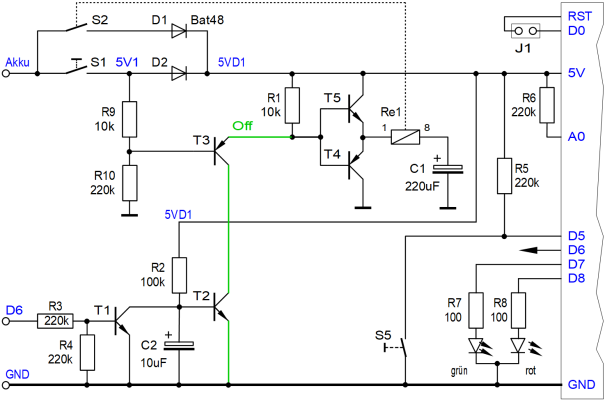
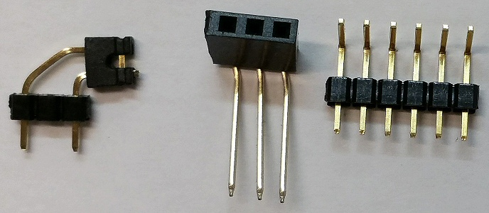
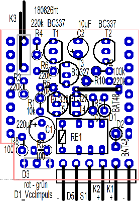

# D1 mini: VccImpuls Shield
Version 2018-08-26   
[<u>English Version</u>](./README.md "English Version") &nbsp; - &nbsp; [<u>Deutsche Beschreibung als pdf</u>](./doku/D1mini_VccImpuls_180826.pdf "German documentation")

Das VccImpuls-Shield ist eine Erweiterung f&uuml;r das D1mini-Board der chinesischen Firma WEMOS und kann auf dieses einfach aufgesteckt werden. Es ist eine Art Selbsthalteschaltung und dient dazu, die Stromversorgung durch einen kurzen Spannungsimpuls einzuschalten und per Software wieder abzuschalten. Da das Schalten mit einem bipolaren Relais erfolgt, ben&ouml;tigt das Board im Ruhezustand keine Energie, was bei Akku-Betrieb einen gro&szlig;en Vorteil darstellt.   

Beispiel f&uuml;r eine Anwendung ist zB eine WLAN-T&uuml;r&uuml;berwachung, die immer dann aktiv wird, wenn die T&uuml;re ge&ouml;ffnet oder geschlossen wird. Das Starten des VccImpuls-Shields kann dabei durch einen Reed-Kontakt oder Mikroschalter erfolgen.   

Folgende IO-Funktionen sind auf dem VccImpuls-Shield verf&uuml;gbar oder auf Stifte oder Buchsen herausgef&uuml;hrt:  

* D5 ......... Zus&auml;tzliches Eingangssignal (zB Taster gegen Masse, Info T&uuml;re offen/geschlossen)
* D6 ......... Selbsthalte-Pin (solange D6=1 ist, bleibt die Stromversorgung eingeschaltet)
* D7 ......... gr&uuml;ne LED (Duo-LED)
* D8 ......... rote LED (Duo-LED)
* D0-RST .. Eine Verbindung von D0 zu RST erm&ouml;glicht es, aus dem Tiefschlaf aufwachen
* A0 ......... Messung der Eingangsspannung

Verwendet man statt der roten und gr&uuml;nen Led eine Duo-Led, so ist auch gelbes Leuchten m&ouml;glich.
Alle Anschl&uuml;sse sind seitlich herausgef&uuml;hrt, damit man weitere Shields aufstecken kann.

# VccImpuls Shield - Details
### Schaltplan
    
 
### Bauteilliste VccImpuls Shield

| No   | Name     | Wert   | Geh&auml;use   |
| ---- | -------- | ------ | -------------- |
|  1   | Re1      | Bipolares Relais, 3VDC, eine Spule, zB Axicom IM41TS (RS-Components 718-1941), Omron G6KU-2P-Y (RS-Components 683-9769) | IM41   |
|  2   | C1       | Elko 220&micro;F   | D5R2,54_ELKO   |
|  3   | C2       | Elko 10&micro;F    | D4R2,54_ELKO   |
|  4   | D1, D2   | BAT48   | DO35_STEHEND_K_UNTEN   |
|  5   | D3       | Duo-LED VRBG5641K (rot, gr&uuml;n) *)   | LED_2X5_3POL   |
|  6   | K1       | Stiftleiste 1x02 **)   | 1X02-90   |
|  7   | K2       | Stiftleiste 1X04 **)   | 1X04-90   |
|  8   | K3       | Stiftleiste 1x03  (lange Stifte, nur 1 und 3 verwendet; 90&deg; abgewinkelt)   | 1X02-90   |
|  9   | R2       | 100k&#8486;   | 0204_STEHEND   |
| 10   | R3, R4, R5, R6, R10   | 220k&#8486;   | 0204_STEHEND         |
| 11   | R1, R9                | 10k&#8486;    | 0204_STEHEND         |
| 12   | R7, R8                | 100&#8486;    | 0207_STEHEND         |
| 13   | T1, T2, T5            | Transistor BC337-40   | TO92                  |
| 14   | T3, T4                | Transistor BC327-40   | TO92                  |
| 15   | 2x                    | Buchsenleiste 8-polig mit langen Anschl&uuml;ssen | WemosShield           |

*) und zus&auml;tzlich eine Buchsenleiste 3polig, 90&deg; abgewinkelt, falls die Duo-LED nicht direkt eingel&ouml;tet werden soll.   
**) oder eine Stiftleiste 6polig, 90&deg; abgewinkelt.

### Weiters

1x 3cm Draht f&uuml;r Br&uuml;cke   
2x Buchsenleiste mit langen Anschl&uuml;ssen, 8polig   
1x Jumper (f&uuml;r K3 zum Verbinden von D0 mit RST)   
1x Durchsichtiges Klebeband (Tixo, Tesa, ...), um Bauteile beim Einl&ouml;ten gegen Herausfallen zu sichern.   
1x Material zur Leiterplattenfertigung:   
Einseitig beschichtete Leiterplatte 28,575 x 26,67 mm&sup2;   
Entwickler, &Auml;tzmittel, Aceton; L&ouml;tlack; L&ouml;tzinn;   
Bohrer 0,8mm und 1,0mm

   
_Bild: Stiftleiste K3 f&uuml;r RST-Jumper, Buchsenleiste f&uuml;r DUO-Led und 6polige Stiftleiste f&uuml;r K1 und K2 in einem._

### Vorschlag Best&uuml;ckungsreihenfolge
   
_Bild: Best&uuml;ckungsplan_

1. Br&uuml;cke   
2. Stiftleisten K1 und K2 (und die Buchse f&uuml;r die Duo-LED, falls eine verwendet werden soll)   
3. Relais   
4. Elko C1   
5. Transistoren T1 bis T5   
6. Dioden D1, D2   
7. Alle Widerst&auml;nde   
8. Elko C2   
9. Stiftleiste K3   
10. Buchsenleisten 8-polig mit langen Anschl&uuml;ssen, links und rechts am Rand

### L&ouml;tseite
   
_Bild: L&ouml;tseite des VccImpuls-Shields_
