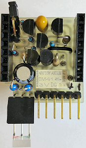
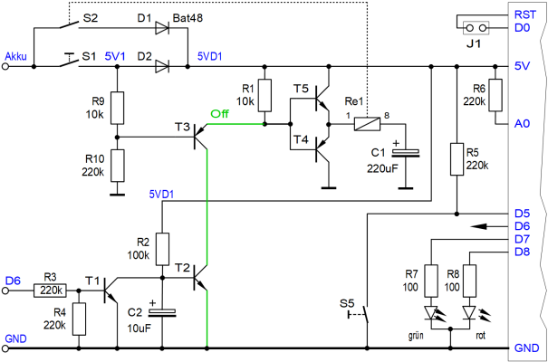
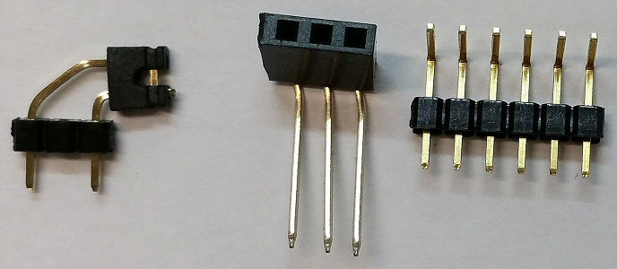
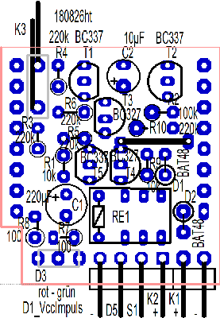
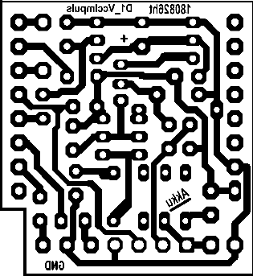

# D1 mini: VccImpuls Shield
Version 2018-08-26   
[ <u>Deutsche Version</u> ](./LIESMICH.md "Deutsche Version") &nbsp; - &nbsp; [<u>German documentation as pdf</u>](./doku/D1mini_VccImpuls_180826.pdf "German documentation")

The VccImpuls shield is an extension for the WEMOS D1mini board and can be put on the board. It is a kind of self locking circuit to switch power on by a short voltage pulse and switch off by software. The switching is done by a bipolar relais, so the board does not need any energy in idle status. That is a nice feature when using batteries or akkus.   

An application example is e.g. to monitor a door by WLAN-switch. The D1 mini starts, when the door is opened or closed. The voltage pulse can be done by a dry reed contact or micro switch.

The following IO-functions of the VccImpuls shield are located on the edge of the board:  

* D5 ......... additional input pin (e.g. button to ground for information, if the door is open/closed)
* D6 ......... self locking pin (as long as D6 is 1, the power supply stays on)
* D7 ......... green LED (Duo-LED)
* D8 ......... red LED (Duo-LED)
* D0-RST .. a connection D0 - RST allows the D1 mini to wake up after deep sleep
* A0 ......... measuring of the input voltage

Using a red-green duo-led, a yellow lightning is possible as well.

# VccImpuls shield - details
### Circuit
    
 
### component list of VccImpuls shield

| num   | name     | value   | package   |
| ----- | -------- | ------- | --------- |
|  1   | Re1      | Bipolar relais, 3VDC, one coil, zB Axicom IM41TS (RS-Components 718-1941), Omron G6KU-2P-Y (RS-Components 683-9769) | IM41   |
|  2   | C1       | Elko 220&micro;F   | D5R2,54_ELKO   |
|  3   | C2       | Elko 10&micro;F    | D4R2,54_ELKO   |
|  4   | D1, D2   | BAT48   | DO35_STEHEND_K_UNTEN   |
|  5   | D3       | Duo-LED VRBG5641K (rot, gr&uuml;n) *)   | LED_2X5_3POL   |
|  6   | K1       | Pin header 1x02 **)   | 1X02-90   |
|  7   | K2       | Pin header 1X04 **)   | 1X04-90   |
|  8   | K3       | Pin header 1x03  (long pins, use only pin 1 and 3; 90&deg;  right-angle   | 1X02-90   |
|  9   | R2       | 100k&#8486;   | 0204_STEHEND   |
| 10   | R3, R4, R5, R6, R10   | 220k&#8486;   | 0204_STEHEND         |
| 11   | R1, R9                | 10k&#8486;    | 0204_STEHEND         |
| 12   | R7, R8                | 100&#8486;    | 0207_STEHEND         |
| 13   | T1, T2, T5            | Transistor BC337-40   | TO92                  |
| 14   | T3, T4                | Transistor BC327-40   | TO92                  |
| 15   | 2x                    | Female connector strip 8-pin with long electrical connections   | WemosShield           |

*) and an additional female connector strip 3 pins, 90&deg;  angled, if the Duo-LED should not be soldered directly on the board.   
**) or a pin header 6 pins, 90&deg; angled.

### Some more things

1x 3cm wire for one bridge   
2x Female connector strip 8-pin with long electrical connections
1x Jumper (for K3 to connect D0 to RST)   
1x Clear adhesive tape (Tixo, Tesa, ...), to fix components before soldering.   
1x Materials to manufacture the print.   
1x Drill 0,8mm and 1,0mm

   
_Picture: Pin header K3 for RST-Jumper, Female connector strip for DUO-Led and a 6 pin header for K1 and K2 all in one._

### Proposal for order of loading
   
_Bild: assembly diagram_

1. Bridge   
2. Pin header K1 and K2 (and the 3 pin female connector strip for the duo-led, if requested)   
3. Relais   
4. Elko C1   
5. Transistor T1 to T5   
6. Diodes D1, D2   
7. All resistors   
8. Elko C2   
9. Pin header K3   
10. Female connector strip 8-pin with long electrical connections

### Solder side
   
_Picture: solder side of VccImpuls shield_
