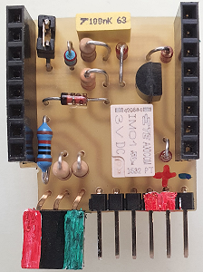
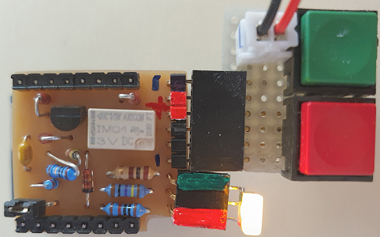
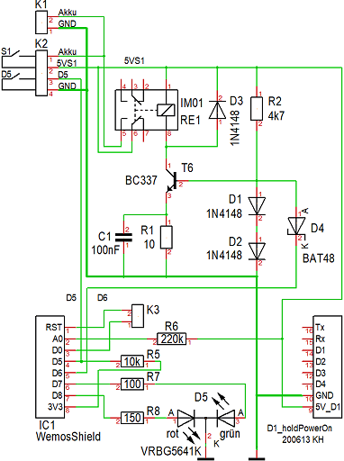
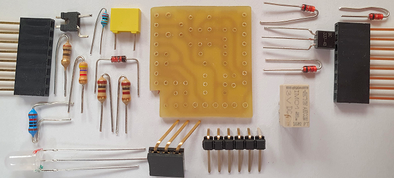
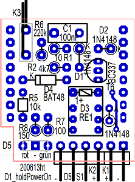
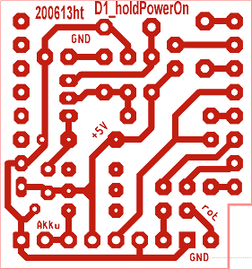

# D1 mini: Eigenbau-Shield holdPowerOn
Version 2020-05-25, Sketch: D1_test_holdPowerOn1.ino   
[English version](./README.md "English version")   

Um einen D1 mini durch einem kurzen (Spannungs-) Impuls einzuschalten, gibt es zwei M&ouml;glichkeiten:   
1. Aufwecken aus dem Tiefschlaf
2. Verwendung des Selbstbau-Shields __D1_holdPowerOn__

Die erste M&ouml;glichkeit setzt voraus, dass der D1 mini st&auml;ndig an einer Versorgungsspannung h&auml;ngt und der Reset-Pin kurz auf 0 gezogen wird. Die steigende Flanke am RST-Pin startet den D1 mini.   

Soll der D1 mini jedoch im Ruhezustand vollst&auml;ndig von der Versorgungsspannung getrennt werden, wird ein Relais ben&ouml;tigt, das durch einen Einschaltimpuls anzieht und so lange eingeschaltet bleibt, bis die Arbeit des D1 mini beendet ist. Dazu dient das Selbstbau-Shield __D1_holdPowerOn__. 
Nach dem Startimpuls muss der Pin D6 m&ouml;glichst schnell auf 1 gesetzt werden, um das Relais zu halten. 
Durch ein 0-Signal am Ausgang D6 wird das Relais losgelassen.   

         
_Bild 1: Das holdPowerOn Shield (Bild rechts: Flache Version mit Test-Taster)_   

F&uuml;r eigene Anwendungen stehen zus&auml;tzlich zur Selbsthaltung noch folgende Funktionen zur Verf&uuml;gung:
* der Anschluss f&uuml;r die Stromversorgung (zB ein Akku)
* der Eingang f&uuml;r den Strom-Ein-Schalter
* ein Anschluss f&uuml;r eine dreipolige DUO-LED
* ein Eingang f&uuml;r einen digitalen Sensor
* Messung der H&ouml;he der Versorgungsspannung
* ein Jumper f&uuml;r das Beenden eines Sleep-Modus

__*Wichtig*__: Die Stromversorgung muss &uuml;ber die Stiftleiste erfolgen (NICHT &uuml;ber USB!)

#### Anschl&uuml;sse (am Bild unten, von links nach rechts)   
* 1-3 ... Dreipolige Rot-Gr&uuml;n-LED. Der mittlere Anschluss ist die gemeinsame Kathode der LED (Masse).
* 4 ... Masse f&uuml;r D5 (= Anschluss Akkuspannung minus)
* 5 ... Eingang nach D5 (zB von einem Schalter)
* 6 ... Eingang vom Einschalter S1
* 7 ... Ausgang zum Einschalter S1 (= Akkuspannung plus)
* 8 ... Anschluss f&uuml;r Akku plus
* 9 ... Anschluss f&uuml;r Akku minus (= Masse)

# holdPowerOn Shield - Details
### Schaltplan
      
_Bild 2: Schaltung des holdPowerOn Shields_   
### Funktion
Die Ansteuerung des Relais erfolgt &uuml;ber eine einfache Stromquelle, damit sie unabh&auml;ngig von der H&ouml;he der Versorgungsspannung ist.   
Bet&auml;tigt man den Schalter/Taster S1, beginnt die Stromquelle (R2, D1, D2; R1, C1, T6) zu arbeiten und das Relais RE1 zieht an. Der D1 mini liegt an der Versorgungsspannung und muss D6 auf 1 (3V3) legen, bevor S1 wieder geöffnet wird.
Die Diode D4 sorgt daf&uuml;r, dass der Ausgang D6 nicht durch die Dioden D2 und D3 auf ca. 1,4V heruntergezogen wird.   
Geht der Ausgang D6 auf 0V, sperrt T6 und das Relais f&auml;llt ab. Ist S1 bereits offen, erh&auml;lt der D1mini keine Spannung mehr.

### Bauteilliste holdPowerOn

| Stk | Name     | Wert   | Geh&auml;use   |
| --- | -------- | ------ | -------------- |
|  1  | K1, K2   | Stiftleiste_1x6 Pin 90&deg; abgewinkelt | 1X06-90 | 
|  1  | D5       | Buchsenleiste 3polig 90&deg; abgewinkelt, lange Pins |  |
|  1  | K3       | Stiftleiste_1x2 Pin, laut Abbildung biegen | X02-90 |
|  2  | (IC1)    | Buchsenleiste 8polig, lange Anschl&uuml;sse | Wemos1 |
|  1  | C1       | 100nF | 4X8R5,08 |
|  3  | D1,D2,D3 | Diode 1N4148 | DO35_STEHEND_K_UNTEN |
|  1  | D4       | BAT48 | DO35 |
|  1  | R1       | 10&#8486; Widerstand | 0204_STEHEND |
|  1  | R2       | 4k7&#8486; Widerstand | 0204_STEHEND |
|  1  | R5       | 10k&#8486; Widerstand | 0204 |
|  1  | R6       | 220k&#8486; Widerstand | 0204_STEHEND |
|  1  | R7       | 100&#8486; Widerstand | 0207_STEHEND |
|  1  | R8       | 150&#8486; Widerstand | 0207_STEHEND |
|  1  | RE1      | Monostabiles Relais IM01TS 3V | IM41 |
|  1  | T6       | Transistor BC337 | TO92 |
| ----- | -------- | -------------- | -------------- |
|  1  | D5       | Duo-LED mit 3 Anschl&uuml;ssen VRBG5641K | LED_2X5_3POL |
|  1  | K3       | Jumper |   |

      
_Bild 3: Bauteile des holdPowerOn Shields_   

### Bestückungsplan
        
_Bild 4: Bauteil- und L&ouml;tseite des holdPowerOn Shields_   

#### Reihenfolge der Bestückung
* Falls die Ground-Verbindung am linken Platinenrand irrt&uuml;mlich zu d&uuml;nn geraten ist (oder weggeschnitten wurde ;) ): Br&uuml;cke neben D3 einlöten   
* Liegende Bauelemente: Stiftleiste K1+K2, Buchsenleiste D5, Widerstand R5, Diode D4   
* Stehend oder liegend montiert: Widerstände R6, R7, R8   
* Stehende Bauelemente: Relais RE1, Dioden D1 bis D3, Widerstände R1 und R2, Jumper K3 (mit gestecktem Jumper l&ouml;ten), Transistor T6, Kondensator C1   
* 8polige Stiftleisten

# Test-Software

